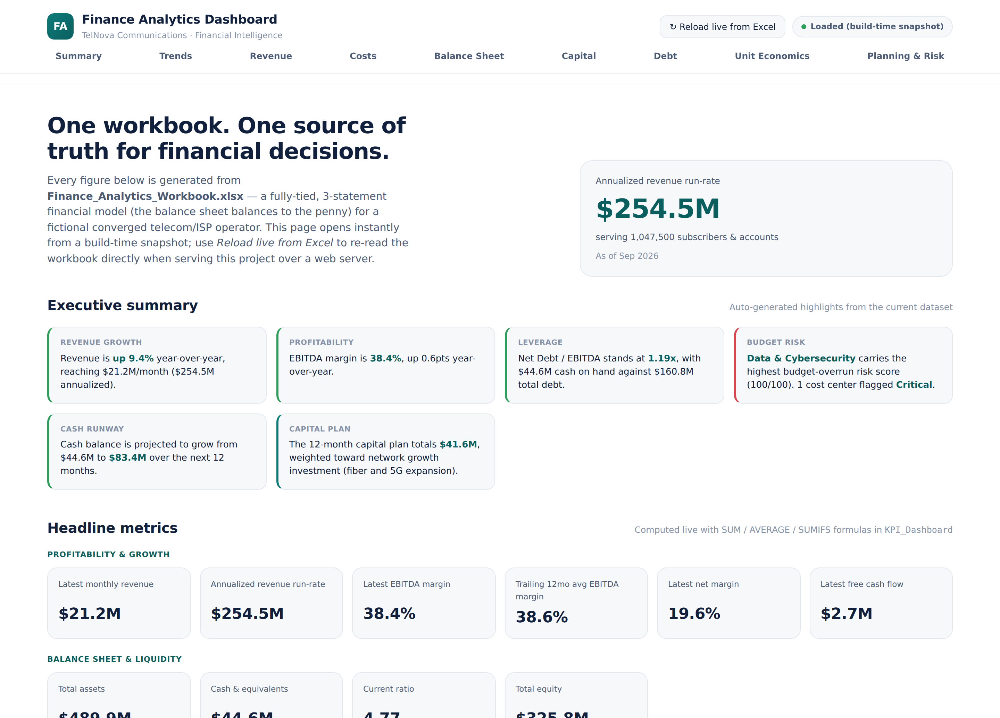
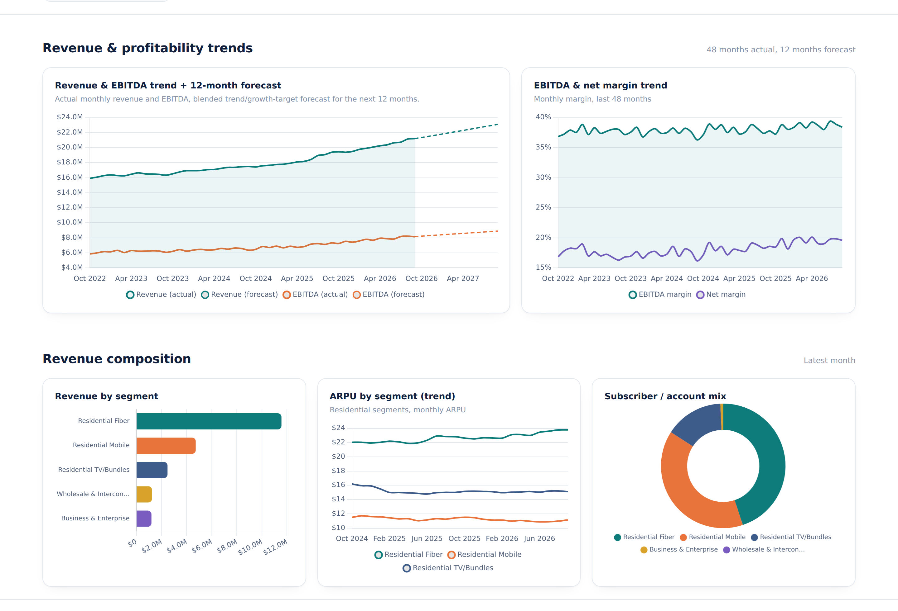
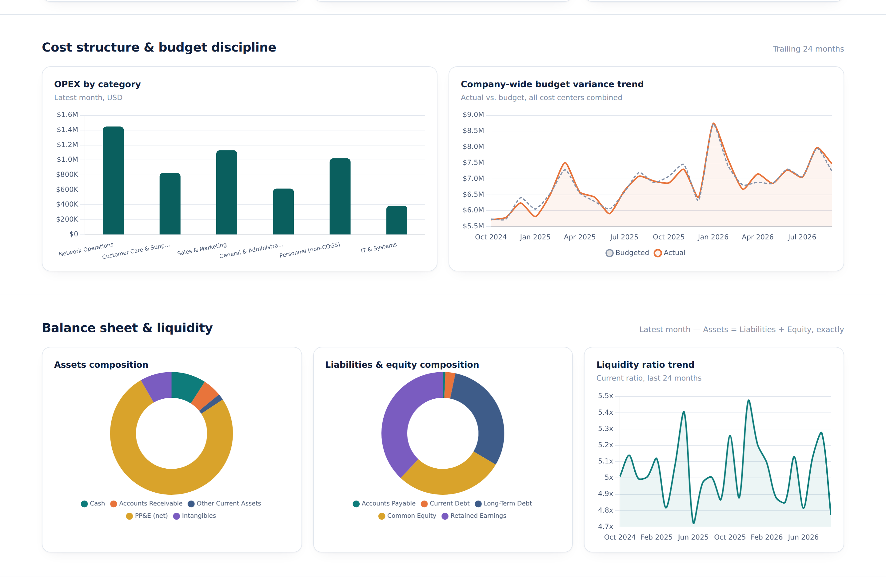
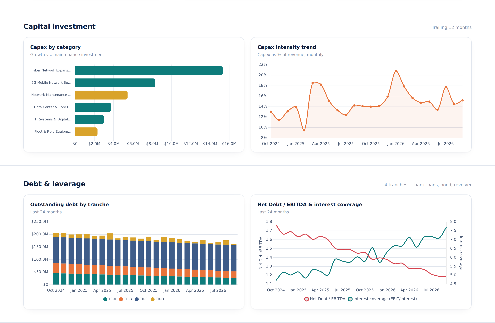
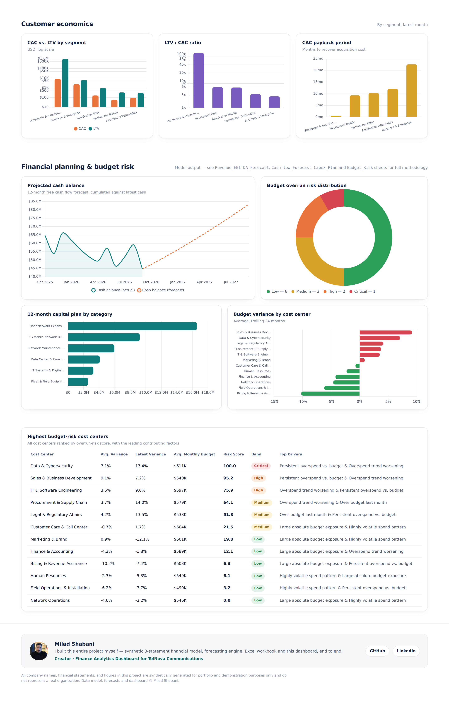

# Finance Analytics Dashboard

**A full-stack Finance / FP&A portfolio project** built around the same fictional telecom & ISP operator as the companion [HR Analytics Dashboard](https://github.com/Milad-Shabani/hr-analytics-dashboard) — a synthetic but fully-tied 3-statement financial model, statistical revenue/EBITDA/cash-flow forecasting, an explainable budget-overrun risk model, and a self-contained interactive HTML dashboard.

> Built as a portfolio project to demonstrate end-to-end financial analytics: from a synthetic general ledger in Python, through a real Excel financial model where the balance sheet balances to the penny, to a dashboard that opens with a single double-click — no database, no backend, no build step, no server required.

<p align="center"><strong>Milad Shabani</strong></p>

---

## Dashboard preview

<p align="center">
  <br>
  <em>Executive summary and headline metrics — auto-generated insights plus 17 KPIs across profitability, balance sheet, capital and unit economics.</em>
</p>

<p align="center">
  <br>
  <em>Revenue &amp; EBITDA trend with 12-month forecast, margin trend, and revenue composition by segment (ARPU, subscriber/account mix).</em>
</p>

<p align="center">
  <br>
  <em>Cost structure (OPEX by category, budget variance) and balance sheet composition — Assets = Liabilities + Equity, exactly.</em>
</p>

<p align="center">
  <br>
  <em>Capital investment (Capex by category, capex intensity) and debt &amp; leverage (tranche schedule, Net Debt/EBITDA, interest coverage).</em>
</p>

<p align="center">
  <br>
  <em>Customer economics (CAC/LTV by segment), 12-month financial planning, budget overrun risk distribution, and the ranked risk table.</em>
</p>

*(Screenshots generated directly from the shipped dashboard — see [Quick start](#quick-start) to run it yourself.)*

---

## Why this project exists

Most "finance dashboard" portfolio pieces show a P&L chart and call it done. This project instead builds the chain a real FP&A function would actually own:

1. A believable operating context — the same converged telecom/ISP as the companion HR project, with **~1,047,500 subscribers and accounts** and **~$255M annualized revenue** across 5 segments (Residential Fiber, Mobile, TV/Bundles, Business & Enterprise, Wholesale & Interconnect).
2. A **synthetic-but-internally-consistent** financial dataset: segment-level revenue and ARPU, a full monthly P&L, a capital project portfolio, and a 4-tranche debt schedule — all generated with reproducible statistical models, not random noise.
3. A **balance sheet and cash flow statement built together in a single pass** so they tie out exactly — Assets = Liabilities + Equity to the penny, every month, for 48 months straight. Cash is the model's plug, derived through the cash flow statement, which is standard 3-statement-model practice (not a hidden "balancing" fudge factor).
4. A **documented financial planning and forecasting model**: 12-month revenue & EBITDA forecasting, free-cash-flow forecasting (Holt's exponential smoothing) with a resulting cash-runway view, a capital plan derived from trailing capex intensity, and an explainable, auditable cost-center budget-overrun risk score — the kind of model an FP&A analyst could defend in a business review, not a black box.
5. A **dashboard generated from that Excel file** — the workbook's data is embedded directly into the HTML at build time, so the file opens instantly with a plain double-click, in any browser, with zero setup. An optional one-click **"Reload live from Excel"** re-parses the actual workbook in the browser whenever the project is served over http/https.

---

## The dashboard

`dashboard/index.html` is a **single, self-contained HTML file** — no server, no framework, no npm install, no CORS issues, no missing-file errors. `scripts/export_dashboard_data.py` bakes the finished workbook's data directly into that file at build time (along with the Chart.js and SheetJS libraries themselves), so opening it always works, even with zero internet access.

Nine sections, 21 charts and a ranked risk table:

- **Executive summary** — auto-generated, plain-language highlights (revenue growth, margin trend, leverage, top budget-risk cost center, cash runway, capital plan size)
- **Headline metrics** — 17 KPIs grouped into Profitability & Growth, Balance Sheet & Liquidity, and Capital/Debt/Unit Economics
- **Revenue & profitability trends** — 48 months actual + 12-month statistical forecast for revenue and EBITDA, plus margin trends
- **Revenue composition** — revenue by segment, ARPU trend by segment, subscriber/account mix
- **Cost structure & budget discipline** — OPEX by category, company-wide budget-vs-actual trend
- **Balance sheet & liquidity** — assets and liabilities/equity composition, current-ratio trend
- **Capital investment** — capex by category (growth vs. maintenance), capex-intensity trend
- **Debt & leverage** — outstanding debt by tranche, Net Debt/EBITDA and interest-coverage trend
- **Customer economics** — CAC vs. LTV by segment, LTV:CAC ratio, CAC payback period
- **Financial planning & budget risk** — projected cash balance, 12-month capital plan, budget-overrun risk distribution, and a ranked table of the highest-risk cost centers with *why* they're flagged

---

## Quick start

### 1. Generate the dataset, build the workbook, and embed dashboard data

```bash
pip install -r requirements.txt
python scripts/build_all.py
```

This runs the full pipeline:

| Step | Script | What it does |
|---|---|---|
| 1 | `scripts/generate_finance_data.py` | Synthesizes segment revenue, P&L, capex projects, debt schedule, budget-vs-actual, and customer economics |
| 2 | `scripts/forecast_engine.py` | Builds the 12-month revenue/EBITDA forecast, cash-flow forecast, capital plan, and cost-center budget-risk scores |
| 3 | `scripts/build_workbook.py` | Assembles the formatted, formula-driven `.xlsx` workbook |
| 4 | *(optional)* LibreOffice recalculation | Bakes cached formula values into the workbook if `soffice` is installed |
| 5 | `scripts/export_dashboard_data.py` | Embeds the workbook's data and Chart.js/SheetJS directly into `dashboard/index.html` |

### 2. Open the dashboard

Just double-click **`dashboard/index.html`** — it works immediately, no server, no internet connection required.

To use the live "Reload from Excel" button instead of the embedded snapshot, serve the project root:

```bash
python -m http.server 8000
```
Then open **http://localhost:8000/dashboard/** and click **"↻ Reload live from Excel."**

---

## Project structure

```
finance-analytics-dashboard/
├── scripts/
│   ├── generate_finance_data.py  # Synthetic 3-statement financial model generator
│   ├── forecast_engine.py        # Revenue/EBITDA/cash-flow forecasting + budget risk scoring
│   ├── build_workbook.py         # Excel workbook builder (formulas, tables, charts)
│   ├── export_dashboard_data.py  # Embeds workbook data + Chart.js/SheetJS into dashboard/index.html
│   ├── build_all.py              # Runs the full pipeline in one command
│   └── vendor/                   # Vendored Chart.js + SheetJS (for fully offline builds)
├── data/
│   └── Finance_Analytics_Workbook.xlsx  # Generated workbook (source of truth)
├── dashboard/
│   ├── index.html                # The dashboard — fully self-contained, data embedded at build time
│   └── assets/
│       └── milad-shabani.jpg     # Creator photo shown in the dashboard footer
├── docs/
│   └── fin-preview-*.png         # Dashboard screenshots used in this README
├── .github/workflows/
│   └── deploy-pages.yml          # Auto-publishes the dashboard to GitHub Pages
├── publish_to_github.sh          # One-command script to push this repo to GitHub (macOS/Linux)
├── requirements.txt
├── LICENSE
└── README.md
```

---

## The data model

**Revenue_By_Segment** (48 months x 5 segments) — subscriber/account counts, ARPU, revenue and gross margin per segment. Residential segments (Fiber, Mobile, TV/Bundles) are sized as a share of the 1,047,500-subscriber base; Business & Enterprise and Wholesale & Interconnect are modeled as their own much smaller account populations (a handful of large contracts), since treating them as "a % of a million subscribers" would imply an implausible number of enterprise accounts.

**PnL** — full monthly income statement: revenue, COGS, gross profit, OPEX by category, EBITDA, D&A, EBIT, interest expense (tied to the actual debt schedule), tax, net income.

**Balance_Sheet** and **Cash_Flow** — built together in a single pass so they're always consistent (see [Financial modeling notes](#financial-modeling-notes) below).

**Capex_Projects** — a project-level capital portfolio across 6 categories (fiber expansion, 5G build-out, data center, IT systems, network maintenance, fleet/field equipment), tagged Growth vs. Maintenance.

**Debt_Schedule** — 4 tranches (2 amortizing bank loans, 1 bullet corporate bond, 1 revolving credit facility) with their own rates, maturities and amortization profiles.

**Budget_vs_Actual** — 24 months x 12 cost centers of budgeted vs. actual spend.

**Customer_Economics** — CAC, LTV, churn, LTV:CAC ratio and payback period per segment.

**KPI_Dashboard** — every headline number as a live formula (`SUM`, `AVERAGE`, `SUMIFS`, `INDEX`) against the raw tables above.

**Revenue_EBITDA_Forecast / Cashflow_Forecast / Capex_Plan / Budget_Risk** — the forecasting layer, described below.

All monetary figures are in USD. All data is synthetic and reproducible (fixed random seed) — see [Data & ethics notice](#data--ethics-notice).

---

## Financial modeling notes

The balance sheet and cash flow statement are **built together in a single pass**, not independently and hoped to match. Working-capital drivers (AR, AP) and PP&E/intangibles are rolled forward using standard 3-statement logic, and **cash is the model's plug** — derived each month as `Prior Cash + CFO + CFI + CFF`, exactly as a real financial model works. This is provably self-consistent: by construction, `ΔTotal Assets = Net Income + ΔAP + ΔDebt − Dividends = ΔTotal Liabilities + ΔEquity` every single month. The workbook's `Balance_Sheet` sheet includes a `BalanceCheckUSD` column that stays at **exactly 0.00** across all 48 months — nothing is hidden or fudged.

Interest expense in the P&L is computed directly from the actual `Debt_Schedule` tranche balances and rates (not a rough approximation), so the income statement, balance sheet and debt schedule all tie to the same numbers.

Customer lifetime value assumes a lifetime of `1 / monthly churn rate`, **capped at 60 months** — a standard practical adjustment, since extrapolating churn indefinitely would imply 20+ year customer relationships at full profit certainty for very low-churn segments (e.g. wholesale carrier contracts), which no real finance team would underwrite an LTV model on.

## The forecasting & planning task

**1. Revenue & EBITDA forecast** — a linear-trend regression on the last 18 months of revenue, blended 50/50 with a stated 8% annual growth target; EBITDA is derived by holding the trailing-12-month average EBITDA margin.

**2. Cash flow / liquidity forecast** — Holt's linear (double) exponential smoothing (α = 0.40, β = 0.25) fitted on 47 months of free cash flow, projected forward and cumulated against the latest cash balance into a 12-month cash-runway view.

**3. Capital plan** — forecast revenue × trailing capex-intensity ratio, allocated to categories using each category's trailing-12-month share of actual spend — the same "derive next year's plan from this year's actuals and a stated growth assumption" logic used in real annual budgeting.

**4. Cost-center budget-overrun risk score** — every cost center scored 0–100 with a fully explainable weighted-factor model:

| Factor | Weight |
|---|---|
| Average historical overspend vs. budget | 32% |
| Worsening overspend trend | 24% |
| Latest-month overspend | 20% |
| Spend volatility | 14% |
| Absolute budget size | 10% |

Scores are min-max scaled across cost centers and bucketed into Low / Medium / High / Critical bands set from this population's own percentiles, with the top two contributing factors surfaced per cost center — auditable in one glance, unlike an opaque ML classifier.

Full methodology notes are written directly into each sheet of the workbook (`Revenue_EBITDA_Forecast`, `Cashflow_Forecast`, `Capex_Plan`, `Budget_Risk`) so any reader can verify exactly how a number was produced.

---

## Publishing this repo

**macOS / Linux:**
```bash
chmod +x publish_to_github.sh
./publish_to_github.sh https://github.com/<your-username>/finance-analytics-dashboard.git
```

Once pushed: **Settings → Pages → Source → GitHub Actions**. The included workflow (`.github/workflows/deploy-pages.yml`) builds and publishes the dashboard automatically on every push to `main`.

> **First deploy shows "Failed to deploy"?** This almost always means the Pages *source* is still set to "Deploy from a branch" instead of "GitHub Actions" — a brand-new repo has no Pages site yet, so the very first API call to enable it must be a `POST`, not a `PUT`. Set it manually once in **Settings → Pages → Source → GitHub Actions**, then re-run the failed workflow from the **Actions** tab (**Re-run all jobs**).

---

## Data & ethics notice

Every financial statement, segment, project and figure in this project is **synthetically generated** with a fixed random seed (`scripts/generate_finance_data.py`). TelNova Communications is a fictional company. No real company's financials are represented. This project is intended purely for analytics portfolio and educational demonstration purposes.

---

## Tech stack

- **Data engineering & modeling:** Python, pandas, NumPy
- **Workbook generation:** openpyxl (native Excel Tables, live formulas, conditional formatting, embedded charts)
- **Dashboard:** vanilla HTML/CSS/JS, [SheetJS](https://sheetjs.com/) for the optional live Excel reload, [Chart.js](https://www.chartjs.org/) for visualization — both vendored and inlined for a fully offline, dependency-free dashboard
- **Deployment:** GitHub Actions → GitHub Pages

---

## Author

**Milad Shabani**
Creator — financial model, forecasting engine, Excel workbook and dashboard, built end to end for this project.
See also: [HR Analytics Dashboard](https://github.com/Milad-Shabani/hr-analytics-dashboard) — the companion People Analytics project for the same fictional company.
